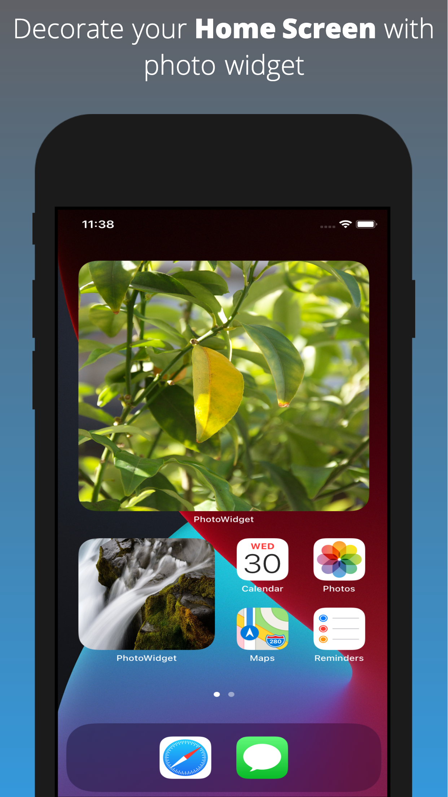
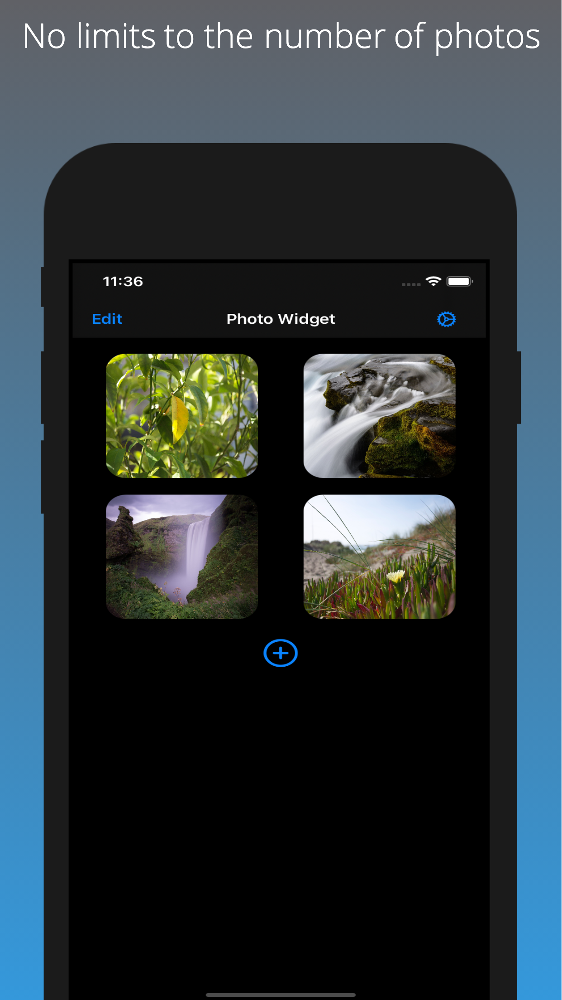
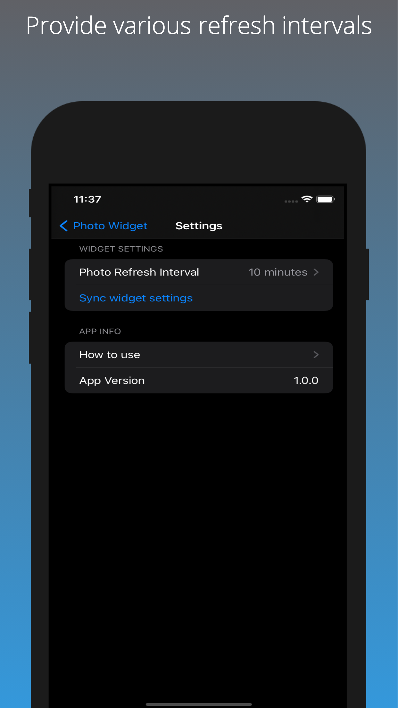

# Photo Widget

### Description:

Decorate your phone home screen with favorite photos of your friends and family, pets or any picture from your photo library.

- Decorate your home screen with photo widget of any size.
- No limits to the number of photos
- Various refresh intervals

Requires IOS14+

### Developers:

- Bohdan Kachur [@Bohdan Kachur](https://github.com/BohdanKachur)

### Technologies:

- SwiftUI
- WidgetKit

### Target: iOS 14

- Dark Mode
- WidgetKit
- SF Symbols

## Screenshots

  

   
   
   
  

